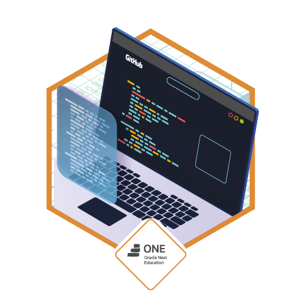

Look in: [English](/README_en.md) | Português

---

# ONE Crypter

Acesse [aqui](https://src-rodrigues.github.io/one-crypter) o projeto.

Projeto realizado para o primeiro desafio proposto pelo programa [ONE](https://www.oracle.com/br/one), um programa em parceria da Alura com a Oracle.

Para auxíliar no desenvolvimento, utilizei a ferramenta de prototipagem figma, no qual você pode ver o resultado [aqui](https://www.figma.com/community/file/1196211686510103802).

Pretendo descrever na aba [wiki](https://github.com/src-rodrigues/one-crypter/wiki), todo o processo de aprendizagem e todas o dificuldades que passei, e coisas que eu ainda não conseguir entender.

Testado no google chrome versão: `109.0.5414.75 (Official Build) (64-bit).` algumas tags ou propriedades podem ser incompatíveis com outras versões.

Objetivos:

- [x] Primeiro Challenge Alura ONE concluído
- [x] Não permite caracteres com acento
- [x] Apenas letras minúsculas
- [x] Alguma responsividade
- [x] Alguma adaptatividade
- [x] Prototipagem no [figma](https://www.figma.com/community/file/1196211686510103802)
- [ ] [Diário de desenvolvimento](https://github.com/src-rodrigues/one-crypter/wiki) completo

Para o futuro:

- [x] Menu com opções
- [x] Seletor de temas
- [x] Botões para limpar, copiar e colar
- [x] Notificações de ações em forma de popup usando transições e/ou animações CSS
- [ ] Usar toda a viewport sem gerar scroll
- [ ] Corrigir os hovers que não fazem sentido nos dispositivos mobile
- [ ] Permitir alguns caracteres que não necessariamente são acentos porém é rejeitado pela RegExp

---

Grato à equipe da ONE por essa oportunidade especial &#128583;

Sugestões são bem vindas na aba <a href="https://github.com/src-rodrigues/one-crypter/discussions">Discussions</a> thx! &#129505;

